<div align="center">



<br/>

[](https://git.io/typing-svg)

<br/>


</div>


## ⚔️ SOLDIER DOSSIER — CLASSIFIED

```
╔══════════════════════════════════════════════════════════════════╗
║        🦅  SURVEY CORPS — SOLDIER PROFILE  🦅                   ║
║              "Dedicate Your Heart"                               ║
╠══════════════════════════════════════════════════════════════════╣
║                                                                  ║
║   SOLDIER ID   : OMAR-NAGI-74                                    ║
║   FULL NAME    : Omar Nagi Elzhari                               ║
║   ORIGIN       : Cairo, Egypt 🇪🇬                                ║
║   REGIMENT     : Survey Corps — Engineering Division             ║
║   RANK         : Scout → Corporal (leveling up...)               ║
║                                                                  ║
╠══════════════════════════════════════════════════════════════════╣
║   WEAPONS OF CHOICE                                              ║
║   ⚔️  Primary   : Java · Dart · Kotlin                           ║
║   🗡️  Secondary : C++ (for the Titans aka hard problems)         ║
║   🛡️  Arsenal   : Flutter · Android SDK · Ktor · Firebase        ║
╠══════════════════════════════════════════════════════════════════╣
║   ACTIVE MISSION                                                 ║
║   🌸  Scentra — Perfume E-Commerce App (Flutter)                 ║
║                                                                  ║
║   ULTIMATE GOAL                                                  ║
║   🎯  Break through the walls → become a Software Engineer       ║
╠══════════════════════════════════════════════════════════════════╣
║   SOLDIER'S OATH                                                 ║
║   "Every problem has a solution.                                 ║
║    Find it. Code it. Ship it.                                    ║
║    Even if I must do it alone." — Omar Nagi                      ║
╚══════════════════════════════════════════════════════════════════╝
```


## 📊 COMBAT STATS — SKILL TREE

```
 ╔═══════════════════════════════════════════════════════╗
 ║              ⚔️  SKILL LEVEL BOARD  ⚔️                ║
 ╠═══════════════════════════════════════════════════════╣
 ║  Android Dev    [██████████████████░░]  90%  ★★★★☆  ║
 ║  Flutter        [████████████████░░░░]  80%  ★★★★☆  ║
 ║  Java           [██████████████████░░]  90%  ★★★★☆  ║
 ║  Kotlin         [██████████████░░░░░░]  70%  ★★★☆☆  ║
 ║  Algorithms     [████████████████░░░░]  80%  ★★★★☆  ║
 ║  Data Struct    [███████████████░░░░░]  75%  ★★★☆☆  ║
 ║  Ktor Backend   [████████████░░░░░░░░]  60%  ★★★☆☆  ║
 ║  System Design  [████████░░░░░░░░░░░░]  40%  ★★☆☆☆  ║
 ║                                    GRINDING... ⚔️    ║
 ╚═══════════════════════════════════════════════════════╝
```

<div align="center">

### 🔥 CURRENTLY LOCKING IN


</div>


## 🏆 ACHIEVEMENTS UNLOCKED

```diff
+ [ACHIEVEMENT] 🥇  Built Scentra — a full Flutter E-Commerce app
+ [ACHIEVEMENT] 🧩  Active Codeforces solver — handle: Nagi_14
+ [ACHIEVEMENT] 📱  Shipped multiple Android apps in Java & Kotlin
+ [ACHIEVEMENT] 🔭  Explored Ktor for backend development
+ [ACHIEVEMENT] 🛡️  Mastered Android SDK fundamentals
! [IN PROGRESS] 🚀  Targeting Software Engineering role
! [IN PROGRESS] 📖  Deep diving into System Design
! [IN PROGRESS] ⚔️  Codeforces rating 1400+ incoming...
```


## ❤️ BEYOND THE WALLS — PERSONAL

```
┌─────────────────────────────────────────────────────────────┐
│  Like Levi, I operate with precision and zero tolerance      │
│  for messy code. Like Eren, I push beyond limits.           │
│                                                             │
│  ❤️  PASSIONS                                               │
│     🎮  Gaming — strategy & RPG games                       │
│     📺  Anime — AOT is life, no debate                      │
│     🧩  Competitive programming — it's my ODM gear          │
│     📱  Building apps that feel alive                        │
│                                                             │
│  🧠  HOW I THINK                                            │
│     → Break every problem into sub-problems (like titans)   │
│     → Research first, code second, ship always              │
│     → Clean architecture > fast & messy                     │
│     → If it compiles on first try — I don't trust it        │
└─────────────────────────────────────────────────────────────┘
```


## 📈 EXPEDITION LOG — LEARNING JOURNEY

```
  2022 ──┤ 🔰 First line of Java written. The wall cracked.
         │
  2023 ──┤ ⚔️  Android SDK mastered. First app shipped.
         │   Flutter discovered. Dart added to arsenal.
         │
  2024 ──┤ 🌸 Scentra born — Flutter e-commerce app.
         │   Codeforces journey started. Nagi_14 online.
         │   Kotlin & Ktor backend exploration begins.
         │
  2025 ──┤ 🚀 System Design. Open Source. SWE Role.
         │   The final wall must fall. ⚔️
         ▼
       [ONGOING — STORY NOT FINISHED]
```


## 🧩 TITAN SLAYING — COMPETITIVE PROGRAMMING

<div align="center">

[](https://codeforces.com/profile/Nagi_14)

</div>

```
  TITANS SLAIN (PROBLEMS SOLVED):

  Div. 4  [████████████████████]  100%  ✅ CLEARED
  Div. 3  [████████████████░░░░]   80%  ⚔️ ACTIVE
  Div. 2  [████████░░░░░░░░░░░░]   40%  🔥 GRINDING
  Div. 1  [██░░░░░░░░░░░░░░░░░░]   10%  👀 ONE DAY...
```


## ⚙️ TECH STACK — EQUIPMENT LOADOUT

<div align="center">

### 〔 MOBILE — PRIMARY WEAPONS 〕


### 〔 BACKEND — SUPPORT GEAR 〕


### 〔 BASE CAMP — DEV ENVIRONMENT 〕


</div>


## 🌸 MISSION FILE — SCENTRA

<div align="center">

> *⚔️ The most dangerous mission yet — building a luxury perfume e-commerce app with Flutter*

</div>

```
┌──────────────────────────────────────────────────────────────┐
│  MISSION: SCENTRA 🌸                          STATUS: ACTIVE  │
├──────────────────────────────────────────────────────────────┤
│  🛒  Full catalog · smart cart · wishlist system             │
│  🔍  Search & filter by fragrance family & notes             │
│  💳  Smooth multi-step checkout flow                         │
│  🔔  Real-time Firebase push notifications                   │
│  🎨  Luxury UI — inspired by high-end fragrance brands       │
├──────────────────────────────────────────────────────────────┤
│  DANGER LEVEL:  [████████████████████]  EXTREME 🔥           │
│  COMPLETION:    [████████████████░░░░]  80% — ALMOST THERE   │
└──────────────────────────────────────────────────────────────┘
```


## 📊 EXPEDITION RECORDS — GITHUB STATS

<div align="center">


<br/>

[](https://git.io/streak-stats)

<br/>

[](https://github.com/ryo-ma/github-profile-trophy)

<br/>

[](https://github.com/ashutosh00710/github-readme-activity-graph)

</div>


## 🐍 CONTRIBUTION SERPENT — THE SNAKE EATS MY COMMITS

<div align="center">

<picture>
  <source media="(prefers-color-scheme: dark)" srcset="https://raw.githubusercontent.com/OmarNagi74/OmarNagi74/output/github-snake-dark.svg" />
  <source media="(prefers-color-scheme: light)" srcset="https://raw.githubusercontent.com/OmarNagi74/OmarNagi74/output/github-snake.svg" />
  
</picture>

</div>


## 🎯 OPERATION 2025 — MISSION BOARD

```diff
+ [ ] ⚔️  Dedicate heart → land a Software Engineering role
+ [ ] 📦  Deploy Scentra to Play Store
+ [ ] 🧩  Crush Codeforces rating 1400+
+ [ ] 🔧  Build production-grade Ktor backend
+ [ ] 📖  Master System Design — crack the walls
+ [ ] 🌍  Contribute to Open Source projects
```


## 📡 SIGNAL TOWER — CONNECT

<div align="center">

[](https://www.linkedin.com/in/omar-nagi-263bss/)
[](mailto:omarnagi424@gmail.com)
[](https://github.com/omarnagi74)
[](https://codeforces.com/profile/Nagi_14)

</div>


<div align="center">

```
⚔️  "If you win, you live. If you lose, you die.
     If you don't fight, you can't win." — Eren Yeager

      ...so I keep coding. Every single day. ⚔️
```

<p align="center">
  
  <br/>
  <b>⚔️ SHINZOU WO SASAGEYO! ⚔️</b>
</p>

<br/>


</div>
